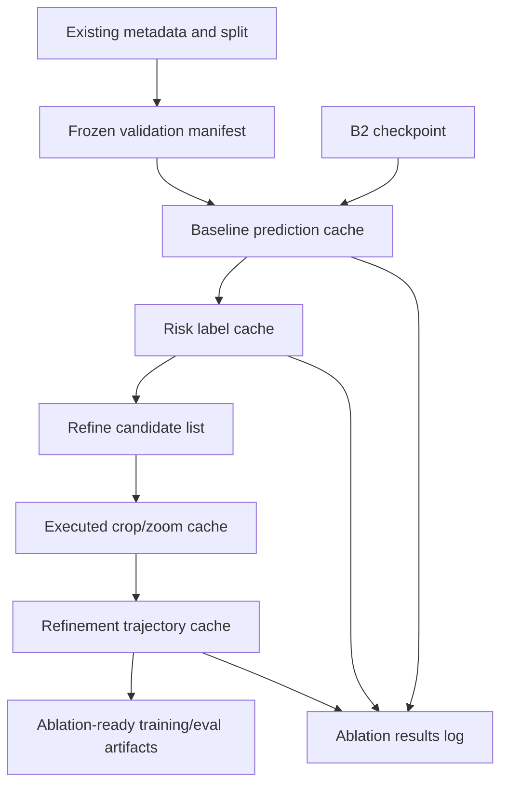

# RUKOPYS HTR - Data Plan Giai Đoạn Tiếp Theo
## Cache-First, Incremental, Ablation-Ready

Tài liệu này là runbook dữ liệu. Mục tiêu là đọc từ trên xuống và biết chính xác cần tạo artifact nào, kiểm tra gì, khi nào được đi tiếp, và khi nào phải dừng.

---

# 0. Cách Dùng Tài Liệu Này

## 0.1 Mục tiêu vận hành

Data plan này phục vụ trực tiếp cho model plan giai đoạn tiếp theo:

- Giữ B2 silver→gold hiện tại làm baseline anchor.
- Không rebuild raw/silver/gold dataset nếu không có lý do bắt buộc.
- Chỉ tạo cache hoặc artifact bổ sung cho đúng ablation đang chạy.
- Mọi kết quả phải tái lập được bằng config đã lưu.
- Mọi quyết định giữ/bỏ phải dựa trên validation metric, không dựa trên cảm giác hoặc ví dụ đơn lẻ.

## 0.2 Hướng metric bắt buộc

Ghi nhớ để tránh nhầm trong mọi bảng kết quả:

| Metric | Hướng tốt |
|---|---|
| `total_score` | càng cao càng tốt |
| `Detection F1` | càng cao càng tốt |
| `ClassAcc` | càng cao càng tốt |
| `Region CER` | càng thấp càng tốt |
| `PageCER` | càng thấp càng tốt |
| `runtime/page` | càng thấp càng tốt, nếu score không đổi |
| `routed_regions/page` | càng thấp càng tốt, nếu score không đổi |

Khi ghi quyết định, dùng câu rõ ràng:

- Đúng: `Giữ vì total_score tăng và PageCER giảm`.
- Sai: `Giữ vì CER tăng`.

## 0.3 Định nghĩa "không chạy lại data"

"Không chạy lại data" nghĩa là:

- Không tạo lại base dataset từ raw.
- Không thay đổi split train/validation/test đang dùng.
- Không rebuild silver/gold dataset từ đầu.
- Không chạy full inference nếu chỉ cần subset cho một ablation.

Được phép:

- Tạo manifest từ metadata hiện có.
- Chạy inference một lần để tạo prediction cache.
- Chạy incremental crop/zoom/feature extraction trên subset đã chọn.
- Tạo version mới của artifact khi config thay đổi.

## 0.4 Quy tắc chống leakage

Validation ground truth được dùng cho:

- tính score;
- phân tích lỗi;
- tạo risk label offline;
- chọn candidate để kiểm tra khả năng phục hồi bằng crop/zoom.

Validation ground truth không được dùng trực tiếp để:

- sinh answer training cho model rồi lại đánh giá trên chính validation đó;
- tune quá nhiều threshold cho tới khi overfit validation;
- claim performance cuối cùng nếu trajectory hoặc training data được tạo từ validation.

Nếu cần train từ trajectory có liên quan tới validation, phải tạo split riêng cho trajectory:

- `trajectory_train`: dùng để train/refine;
- `trajectory_eval`: giữ lại để đánh giá;
- hoặc dùng source/record split khác B2 validation chính.

## 0.5 Quy tắc versioning

Mọi artifact sinh ra phải có ít nhất các khóa sau trong config:

- `artifact_name`
- `artifact_version`
- `source_manifest`
- `checkpoint_id`
- `prompt_version`
- `generator_model`
- `generation_params`
- `metric_version`
- `code_version` hoặc notebook version nếu có
- `created_at`

Không ghi đè âm thầm. Nếu chạy lại cùng config:

- resume nếu output trước đó hợp lệ;
- ghi failed rows vào file lỗi;
- hoặc tạo version mới có suffix rõ ràng, ví dụ `risk_v2`, `crop_smart_v3`.

---

# 1. Artifact Ladder Tổng Thể

Luồng dữ liệu chuẩn:



Thứ tự làm việc bắt buộc:

1. Khóa `frozen_validation_manifest.jsonl`.
2. Tạo hoặc xác nhận `baseline_predictions_cache/` cho B2.
3. Tạo `risk_labels_cache.parquet` từ prediction cache.
4. Tạo `refine_candidates.jsonl` từ risk labels.
5. Tạo crop/zoom cache cho subset nhỏ.
6. Tạo trajectory cache chỉ khi crop/zoom có tín hiệu tốt.
7. Ghi mọi ablation vào `ablation_results.csv`.

Không đi sang bước sau nếu gate của bước trước chưa pass.

---

# 2. Cấu Trúc Artifact Khuyến Nghị

Giữ tên artifact logic như hiện tại, nhưng bên trong nên version rõ:

```text
artifacts/
  manifests/
    frozen_validation_manifest.v1.jsonl
    frozen_validation_manifest.v1.config.json

  baseline_predictions_cache/
    b2_stage2_gold__crop-none__prompt-v1/
      config.json
      validation_predictions.csv
      validation_raw_outputs.jsonl
      validation_score.json
      failed_rows.jsonl

    b2_stage2_gold__crop-smart__prompt-v1/
      ...

  risk_labels/
    risk_labels__b2_stage2_gold__risk-v1.parquet
    risk_labels__b2_stage2_gold__risk-v1.config.json

  candidates/
    refine_candidates__b2_stage2_gold__risk-v1.jsonl
    refine_candidates__b2_stage2_gold__risk-v1.config.json

  crops/
    zoom_only__b2_stage2_gold__candidates-v1/
      crop_metadata.jsonl
      images/

  trajectories/
    refine_trajectories__zoom-only__v1.jsonl
    refine_trajectories__zoom-only__v1.config.json

  ablations/
    ablation_results.csv
```

Nếu code hiện tại đang dùng path cũ như `baseline_predictions_cache/` ở repo root, vẫn có thể giữ. Yêu cầu quan trọng là mỗi artifact phải có config và version rõ.

---

# 3. Stage A - Frozen Validation Manifest

## 3.1 Mục tiêu

Tạo một validation manifest cố định để mọi model, routing, crop, post-processing và submission builder được so sánh công bằng.

## 3.2 Input

- Metadata validation hiện có.
- Split validation đang được dùng cho B2.
- Image files tương ứng.
- Ground truth regions nếu validation có annotation.

## 3.3 Việc cần làm

1. Đọc validation records hiện tại.
2. Giữ nguyên danh sách image và thứ tự image.
3. Ghi mỗi image thành một dòng JSONL.
4. Không rename field gốc nếu không cần.
5. Nếu thiếu `region_id`, tạo `region_id` ổn định theo quy tắc cố định.
6. Ghi config manifest để biết manifest được tạo từ source nào.

## 3.4 Schema tối thiểu

Mỗi dòng:

```json
{
  "image_id": "...",
  "file_name": "images/...",
  "source": "archive|school|dictation|university|unknown",
  "image_width": 1234,
  "image_height": 1234,
  "regions": []
}
```

Mỗi region nếu có annotation:

```json
{
  "region_id": "...",
  "type": "handwritten|printed|formula|table|annotation|image|graph|unknown",
  "bbox": [x1, y1, x2, y2],
  "text": "..."
}
```

## 3.5 Quy tắc bbox

Chuẩn nội bộ nên dùng:

- format: `xyxy`;
- hệ tọa độ: pixel trên ảnh gốc;
- `x1 < x2`, `y1 < y2`;
- bbox đã clip vào `[0, image_width]` và `[0, image_height]`;
- nếu metadata gốc dùng convention khác, lưu thêm `bbox_original` và `bbox_format_original`.

## 3.6 Pass gate

Pass nếu:

- số image bằng đúng validation split hiện tại;
- mọi `file_name` trỏ tới image tồn tại;
- mọi `image_id` unique;
- nếu có `region_id`, mọi `(image_id, region_id)` unique;
- mọi bbox hợp lệ hoặc được đánh dấu lỗi rõ;
- config manifest được lưu.

## 3.7 Fail gate

Fail nếu:

- thiếu image;
- image order không xác định;
- có duplicate `image_id`;
- bbox không thể chuẩn hóa;
- không biết manifest được tạo từ split nào.

## 3.8 Quyết định tiếp theo

- Nếu pass: khóa manifest version này, dùng cho tất cả ablation.
- Nếu fail: sửa manifest/evaluation trước, không chạy B2 cache.

---

# 4. Stage B - Baseline Prediction Cache Cho B2

## 4.1 Mục tiêu

Cache prediction của B2 để:

- biết B2 hiện tại mạnh/yếu ở đâu;
- không phải chạy lại B2 cho mỗi analysis;
- tạo risk labels và refine candidates từ output đã cố định.

## 4.2 Input

- `frozen_validation_manifest`.
- B2 checkpoint hiện tại.
- Prompt version đang dùng.
- Inference config đang dùng.
- Official-compatible metric.

## 4.3 Việc cần làm

1. Chạy B2 trên frozen validation đúng một lần cho mỗi config.
2. Lưu raw output trước khi parse.
3. Parse output thành `regions`.
4. Score bằng metric cố định.
5. Lưu failed rows riêng, không bỏ âm thầm.
6. Ghi đủ config để tái lập.

## 4.4 Output bắt buộc

```text
baseline_predictions_cache/
  <run_id>/
    config.json
    validation_predictions.csv
    validation_raw_outputs.jsonl
    validation_score.json
    failed_rows.jsonl
```

`run_id` nên chứa:

- checkpoint;
- crop mode;
- prompt version;
- decoding config;
- ngày hoặc version.

Ví dụ:

```text
b2_stage2_gold__crop-none__prompt-v1
```

## 4.5 `validation_predictions.csv`

Tối thiểu nên có:

| Column | Ý nghĩa |
|---|---|
| `image_id` | id từ frozen manifest |
| `file_name` | path ảnh |
| `regions` | JSON string list regions đã parse |
| `parse_ok` | true/false |
| `error_type` | rỗng nếu pass |
| `raw_output_id` | khóa sang raw output |
| `checkpoint_id` | checkpoint tạo output |
| `prompt_version` | prompt tạo output |

## 4.6 `validation_score.json`

Tối thiểu nên có:

```json
{
  "total_score": 0.0,
  "detection_f1": 0.0,
  "class_acc": 0.0,
  "region_cer": 0.0,
  "page_cer": 0.0,
  "row_count": 0,
  "parse_fail_count": 0,
  "runtime_total_sec": 0.0,
  "runtime_per_page_sec": 0.0,
  "metric_version": "..."
}
```

## 4.7 Pass gate

Pass nếu:

- số row prediction bằng số row manifest;
- `regions` parse được thành JSON list;
- malformed JSON dưới ngưỡng cho phép, mặc định `<= 0.5%` hoặc `<= 3 rows`, lấy ngưỡng nào lớn hơn;
- score chạy được;
- score breakdown có đủ `total_score`, `Detection F1`, `ClassAcc`, `Region CER`, `PageCER`;
- config đủ để tái lập.

## 4.8 Fail gate

Fail nếu:

- thiếu image;
- nhiều output không parse được;
- metric không chạy được;
- thiếu raw output;
- không biết checkpoint/prompt/config nào tạo prediction.

## 4.9 Quyết định tiếp theo

- Nếu B2 cache pass: chuyển sang risk label.
- Nếu B2 cache fail: sửa inference/evaluation trước, chưa làm B3/B4.

---

# 5. Stage C - Risk Label Cache

## 5.1 Mục tiêu

Tạo nhãn rủi ro từ prediction cache để biết vùng nào nên được crop/zoom/refine.

Đây là bước rẻ. Làm rule-based trước, chưa cần hidden-state probe.

## 5.2 Input

- `validation_predictions.csv`.
- `validation_raw_outputs.jsonl`.
- Ground truth từ frozen validation.
- Metric normalizer giống official-compatible metric.
- Risk rule config.

## 5.3 Việc cần làm

1. Join prediction với ground truth theo `image_id` và `region_id`.
2. Tính `exact_match`.
3. Tính `cer`.
4. Gắn `failure_tags`.
5. Gắn `risk_label_binary`.
6. Gắn `risk_label_ordinal`.
7. Ghi parquet và config.

## 5.4 Schema tối thiểu

```json
{
  "image_id": "...",
  "region_id": "...",
  "source": "archive|school|dictation|university|unknown",
  "region_type": "handwritten|printed|formula|table|annotation|image|graph|unknown",
  "bbox": [x1, y1, x2, y2],
  "ground_truth": "...",
  "first_pass_prediction": "...",
  "cer": 0.42,
  "exact_match": false,
  "risk_label_binary": 1,
  "risk_label_ordinal": "safe|risky|catastrophic",
  "failure_tags": ["high_cer", "empty_prediction"],
  "checkpoint_id": "b2_stage2_gold",
  "prompt_version": "prompt-v1"
}
```

## 5.5 Risk rules mặc định

Các ngưỡng dưới đây là default khởi điểm. Có thể chỉnh, nhưng phải ghi vào config.

| Label | Điều kiện gợi ý |
|---|---|
| `safe` | exact match, hoặc `cer <= 0.05` |
| `risky` | `cer >= 0.15`, text quá ngắn/dài bất thường, disagreement cao, hoặc rule flag |
| `catastrophic` | prediction rỗng khi GT có text, malformed JSON, repetition loop, hallucination dài, hoặc `cer >= 0.60` |

Failure tags nên tách nhỏ:

- `empty_prediction`
- `malformed_json`
- `high_cer`
- `very_high_cer`
- `too_short`
- `too_long`
- `repetition`
- `invalid_region_type`
- `bbox_invalid`
- `source_specific_error`

## 5.6 Pass gate

Pass nếu:

- mỗi region có `cer` hoặc có lý do không tính được;
- mọi threshold nằm trong config;
- risk distribution được thống kê theo `source` và `region_type`;
- có bảng top failure tags;
- output có thể join ngược lại prediction và manifest.

## 5.7 Fail gate

Fail nếu:

- join prediction/GT không ổn định;
- thiếu nhiều `region_id`;
- risk label phụ thuộc logic hard-code không có config;
- không phân biệt được lỗi parse, lỗi detection, lỗi OCR.

## 5.8 Quyết định tiếp theo

- Nếu risk label cho thấy nhóm lỗi rõ: tạo candidate list.
- Nếu risk label không tách được failure group: chỉ dùng làm analysis, chưa làm probe.

---

# 6. Stage D - Refine Candidate List

## 6.1 Mục tiêu

Chọn subset nhỏ, có khả năng cải thiện bằng crop/zoom, để test refinement trước khi tạo trajectory lớn.

Không chọn candidate chỉ vì lỗi nặng. Candidate tốt phải vừa sai, vừa có khả năng phục hồi bằng evidence mới.

## 6.2 Input

- `risk_labels_cache`.
- Frozen manifest.
- B2 prediction cache.
- Candidate selection config.

## 6.3 Việc cần làm

1. Loại bỏ region đã exact match.
2. Loại bỏ non-text mặc định, trừ khi đang test riêng.
3. Ưu tiên handwritten/annotation/printed text có CER cao.
4. Ưu tiên vùng nhỏ, mờ, thiếu context, hoặc source khó.
5. Giữ cân bằng theo `source` và `region_type`.
6. Gắn priority `P0`, `P1`, `P2`.
7. Ghi lý do chọn candidate.

## 6.4 Priority rule

| Priority | Ý nghĩa | Điều kiện gợi ý |
|---|---|---|
| `P0` | Nên test đầu tiên | high CER nhưng crop có khả năng giúp, text-like, bbox hợp lệ |
| `P1` | Test sau P0 | medium CER, source khó, hoặc disagreement cao |
| `P2` | Analysis/exploration | case đặc biệt như formula/table nếu error analysis ủng hộ |

## 6.5 Cap mặc định

Nếu validation nhỏ:

- lấy toàn bộ P0/P1 hợp lệ.

Nếu validation lớn:

- P0: tối đa `min(500, 30% risky regions)`;
- P1: tối đa `min(500, 30% risky regions)`;
- P2: tối đa `min(100, 10% risky regions)`.

Các cap này chỉ là default. Khi đổi phải ghi vào config.

## 6.6 Schema output

```json
{
  "candidate_id": "...",
  "image_id": "...",
  "region_id": "...",
  "source": "archive",
  "region_type": "handwritten",
  "bbox_region": [x1, y1, x2, y2],
  "ground_truth": "...",
  "first_pass_prediction": "...",
  "first_pass_cer": 0.37,
  "risk_reason": ["high_cer", "small_text"],
  "candidate_priority": "P0",
  "selection_version": "candidate-v1"
}
```

## 6.7 Pass gate

Pass nếu:

- mọi candidate có `candidate_id` unique;
- mọi candidate join được về manifest và risk label;
- bbox hợp lệ;
- có phân bố candidate theo source/type/priority;
- không bị một source hoặc một type chiếm quá mức nếu không cố ý.

## 6.8 Fail gate

Fail nếu:

- candidate gồm quá nhiều case không thể phục hồi;
- candidate quá lệch vào một source;
- thiếu lý do chọn;
- chứa nhiều exact-match regions.

## 6.9 Quyết định tiếp theo

- Nếu candidate list hợp lý: tạo crop/zoom cache.
- Nếu candidate list không hợp lý: chỉnh rule selection, không chạy model refine.

---

# 7. Stage E - Executed Crop/Zoom Cache

## 7.1 Mục tiêu

Tạo crop thật từ ảnh thật để kiểm tra xem visual evidence bổ sung có giúp OCR không.

Không dùng fake tool call làm dữ liệu train chính.

## 7.2 Input

- `refine_candidates.jsonl`.
- Original image files.
- Crop config.

## 7.3 Action set v1

Giữ action set nhỏ:

| Action | Dùng khi nào |
|---|---|
| `CropZoomIn` | vùng text nhỏ/mờ, cần phóng to |
| `ExpandContext` | cần thêm chữ xung quanh để đọc đúng |
| `Finalize` | trả transcription cuối |

## 7.4 Quy tắc crop

Mặc định:

- input bbox là `bbox_region` theo pixel ảnh gốc;
- crop phải clip vào image bounds;
- margin mặc định: `5-15%` chiều rộng/cao bbox, ghi trong config;
- scale mặc định: `2x`, hoặc giới hạn bởi `max_pixels`;
- không tạo crop quá nhỏ, quá lớn, hoặc rỗng;
- lưu metadata trước khi dùng crop cho model.

## 7.5 Schema crop metadata

```json
{
  "crop_id": "...",
  "candidate_id": "...",
  "image_id": "...",
  "region_id": "...",
  "tool": "CropZoomIn",
  "bbox_input": [x1, y1, x2, y2],
  "bbox_crop": [x1, y1, x2, y2],
  "scale": 2,
  "margin_ratio": 0.10,
  "crop_path": "...",
  "crop_width": 512,
  "crop_height": 160,
  "overlap_with_region": 0.91,
  "created_at": "..."
}
```

## 7.6 Pass gate

Pass nếu:

- mỗi crop file tồn tại;
- bbox crop hợp lệ;
- overlap với region đủ cao, mặc định `>= 0.80` với `CropZoomIn`;
- crop không vượt `max_pixels`;
- crop metadata join được về candidate;
- có failed crop log.

## 7.7 Fail gate

Fail nếu:

- crop không tồn tại;
- bbox sai hệ tọa độ;
- crop bị rỗng hoặc chỉ chứa background;
- crop quá lớn làm runtime vượt budget;
- nhiều candidate fail crop mà không có lý do.

## 7.8 Quyết định tiếp theo

- Nếu crop cache pass: dùng cho zoom-only ablation.
- Nếu crop cache fail: sửa crop executor/config trước, chưa tạo trajectory.

---

# 8. Stage F - Refinement Trajectory Cache

## 8.1 Mục tiêu

Lưu các lần refinement có executed crop thật, answer cuối, metric delta, và label chất lượng.

Trajectory chỉ nên dùng train nếu nó có bằng chứng thật và không làm kết quả tệ hơn.

## 8.2 Input

- Candidate list.
- Crop metadata.
- B2 first-pass prediction.
- Teacher/model output trên crop.
- Ground truth để score offline.

## 8.3 Trajectory format

Mỗi trajectory nên có:

```json
{
  "trajectory_id": "...",
  "candidate_id": "...",
  "image_id": "...",
  "region_id": "...",
  "initial_prediction": "...",
  "initial_cer": 0.37,
  "actions": [
    {
      "action": "CropZoomIn",
      "crop_id": "...",
      "observation": "crop image path or reference"
    },
    {
      "action": "Finalize",
      "answer": "..."
    }
  ],
  "final_prediction": "...",
  "final_cer": 0.21,
  "cer_delta": -0.16,
  "trajectory_label": "positive_improving",
  "qc_status": "pass",
  "failure_reason": null
}
```

`cer_delta = final_cer - initial_cer`.

- `cer_delta < 0`: tốt hơn.
- `cer_delta = 0`: không đổi.
- `cer_delta > 0`: tệ hơn.

## 8.4 Label trajectory

| Label | Điều kiện |
|---|---|
| `positive_improving` | `final_cer < initial_cer` |
| `positive_equal` | `final_cer == initial_cer`, format đúng, evidence hợp lệ |
| `negative` | `final_cer > initial_cer`, dùng analysis/reranking, không dùng SFT mặc định |
| `invalid` | parse fail, crop fail, hallucination dài, hoặc action không execute |

## 8.5 Pass gate cho training pool

Pass nếu:

- action parse được;
- crop thật tồn tại;
- answer parse được;
- final answer là string ngắn, không hallucinate;
- `final_cer <= initial_cer` với sample dùng train positive;
- trajectory có source/candidate/config rõ.

## 8.6 Fail gate

Fail nếu:

- không execute crop thật;
- fake tool text xuất hiện như observation chính;
- answer dài bất thường;
- reasoning chung chung không gắn với ảnh;
- nhiều trajectory `negative` nhưng vẫn bị đưa vào train positive.

## 8.7 Quyết định tiếp theo

- Nếu zoom-only cải thiện: có thể sinh compact evidence/refinement trajectory.
- Nếu zoom-only không cải thiện: dừng branch refinement cho Kaggle, chỉ giữ vài case cho paper/error analysis.

---

# 9. Stage G - Ablation Results Log

## 9.1 Mục tiêu

Mọi ablation phải ghi vào một bảng duy nhất để quyết định giữ/bỏ.

Không kết luận bằng notebook output rời rạc.

## 9.2 Schema `ablation_results.csv`

Tối thiểu:

| Column | Ý nghĩa |
|---|---|
| `run_id` | id duy nhất của ablation |
| `stage` | B2, crop_mode, risk, zoom_only, reasoning, B3, B4 |
| `checkpoint_id` | checkpoint dùng |
| `artifact_version` | data artifact version |
| `prompt_version` | prompt |
| `crop_mode` | none/smart/all_text/zoom_only |
| `routing_rule` | none/rule/entropy/probe |
| `routing_threshold` | threshold nếu có |
| `total_score` | càng cao càng tốt |
| `detection_f1` | càng cao càng tốt |
| `class_acc` | càng cao càng tốt |
| `region_cer` | càng thấp càng tốt |
| `page_cer` | càng thấp càng tốt |
| `runtime_per_page_sec` | runtime |
| `routed_regions_per_page` | số region phải refine |
| `decision` | keep/drop/analysis_only |
| `decision_reason` | lý do ngắn, có metric |

## 9.3 Decision rule mặc định

Giữ một ablation nếu:

- `total_score` tăng so với baseline liên quan; hoặc
- `PageCER`/`Region CER` giảm mà `total_score` không giảm đáng kể; và
- runtime không vượt budget; và
- không làm tăng parse/hallucination failure.

Bỏ một ablation nếu:

- `total_score` giảm rõ;
- PageCER tăng;
- runtime tăng mạnh nhưng score không tăng;
- output khó tái lập;
- chỉ tốt trên vài ví dụ riêng lẻ.

---

# 10. Data Gates Theo Model Variant

| Variant | Data cần có | Được tạo mới? | Gate để đi tiếp |
|---|---|---:|---|
| B2 silver→gold | frozen manifest + baseline cache | chỉ cache prediction nếu chưa có | B2 score ổn định |
| B2 crop mode | baseline cache theo mode | có, mỗi mode một run | chọn mode có score tốt nhất và runtime hợp lý |
| B3 zoom-only | candidates + crop cache | có, subset nhỏ | routed-region CER giảm, PageCER không tệ hơn |
| B3 compact evidence | trajectory cache | có, chỉ subset có zoom gain | hơn zoom-only hoặc giảm hallucination |
| B4 routing | risk labels + routing curve | rẻ trước, probe sau | tiết kiệm compute hoặc tăng score |
| B5 memory/RL | high-quality trajectories | late-stage | chỉ research nếu B3/B4 đã có gain rõ |

---

# 11. Checklist Làm Việc

## 11.1 Must-do

1. Khóa `frozen_validation_manifest`.
2. Tạo hoặc xác nhận B2 baseline cache.
3. Xác nhận metric direction và score breakdown.
4. Tạo risk label cache từ B2 cache.
5. Tạo candidate subset nhỏ, cân bằng source/type.
6. Tạo executed crop cache.
7. Test one-step zoom-only.
8. Chỉ tạo trajectory/refinement data nếu zoom-only có tín hiệu tốt.
9. Ghi mọi kết quả vào `ablation_results.csv`.

## 11.2 Should-do

1. Source-wise error slices.
2. Type-wise error slices.
3. Routing curve theo routed fraction.
4. Runtime/page và routed regions/page.
5. Parse failure report.

## 11.3 Optional

1. Hidden-state probe.
2. Multi-step memory.
3. RL/GRPO.
4. Synthetic handwriting cho confusion đã chứng minh bằng error analysis.

---

# 12. Rủi Ro Và Cách Giảm

| Rủi ro | Tác động | Cách giảm |
|---|---|---|
| Rebuild data quá rộng | mất thời gian, không biết gain từ đâu | cache-first, ablation từng phần |
| Metric direction bị hiểu sai | giữ nhầm model tệ hơn | ghi rõ score tăng, CER giảm |
| Validation leakage | local score đẹp nhưng generalize kém | tách analysis/train/eval, không train trên validation rồi score lại |
| Candidate toàn lỗi không phục hồi | zoom/refine không có cơ hội cải thiện | chọn hard but recoverable |
| Crop sai coordinate | model nhìn sai vùng | chuẩn hóa bbox, log crop metadata, QC overlap |
| Trajectory hậu nghiệm chung chung | train không cải thiện | chỉ dùng executed crop thật, QC bằng CER delta |
| Hard-region oversampling | giảm easy OCR | giữ base transcription mix khi train |
| Probe hidden-state tốn công | chậm tiến độ | chỉ làm sau rule routing và zoom-only có gain |

---

# 13. Kết Luận Vận Hành

Data strategy ở giai đoạn này là:

1. Không tạo thêm data lớn trước khi biết lỗi nằm ở đâu.
2. Khóa B2 làm anchor.
3. Tạo cache incremental cho từng ablation.
4. Chỉ mở rộng data khi validation chứng minh bước đó giúp `total_score` tăng hoặc `CER/PageCER` giảm.
5. Mọi artifact phải có config, version, pass/fail gate, và dòng kết quả trong `ablation_results.csv`.

Nếu một bước không giúp score, không giúp analysis, hoặc không tái lập được, dừng ở bước đó và không mở rộng tiếp.
