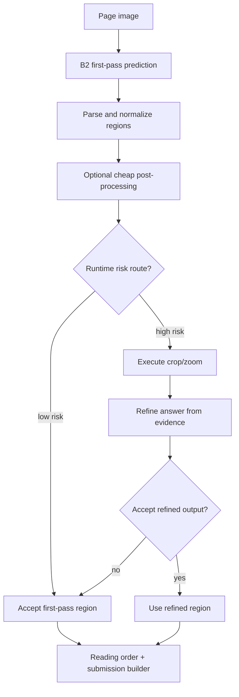
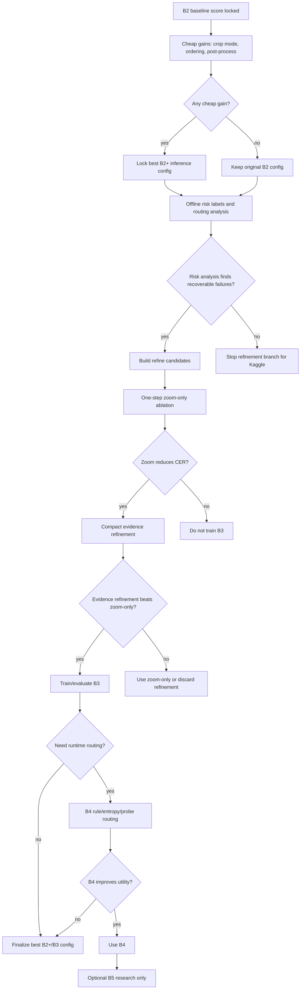

# RUKOPYS HTR - Model Plan Giai Đoạn Tiếp Theo
## Risk-Aware Interactive Refinement Theo Ablation Từng Phần

Tài liệu này là runbook model. Mục tiêu là đọc từ trên xuống và biết ở mỗi stage cần chạy thí nghiệm nào, dùng artifact nào, giữ/bỏ theo metric nào, và khi nào được phép train model mới.

---

# 0. Cách Dùng Tài Liệu Này

## 0.1 Mục tiêu

Cải thiện B2 silver→gold hiện tại mà không biến next phase thành một lần build lại toàn bộ.

Nguyên tắc:

- B2 là baseline anchor.
- Mọi thay đổi phải là một ablation riêng.
- Nếu ablation tăng score hoặc giảm lỗi quan trọng thì giữ.
- Nếu ablation giảm score, tăng hallucination, hoặc tăng runtime không đáng thì bỏ hoặc chỉ giữ cho analysis.
- Không train B3/B4/B5 chỉ vì plan có ghi. Chỉ train khi stage trước đã có evidence.

## 0.2 Phụ thuộc vào Data Plan

Model plan này dùng trực tiếp các artifact trong `Data_Plan.md`:

- `frozen_validation_manifest`
- `baseline_predictions_cache/`
- `risk_labels_cache`
- `refine_candidates.jsonl`
- `executed crop/zoom cache`
- `refine_trajectories_cache`
- `ablation_results.csv`

Nếu các artifact này chưa pass gate trong Data Plan, không chạy stage model tương ứng.

## 0.3 Hướng metric bắt buộc

| Metric | Hướng tốt |
|---|---|
| `total_score` | càng cao càng tốt |
| `Detection F1` | càng cao càng tốt |
| `ClassAcc` | càng cao càng tốt |
| `Region CER` | càng thấp càng tốt |
| `PageCER` | càng thấp càng tốt |
| `runtime/page` | càng thấp càng tốt nếu score không đổi |
| `routed_regions/page` | càng thấp càng tốt nếu score không đổi |

Trong tài liệu này, "CER cải thiện" luôn nghĩa là `CER giảm`.

## 0.4 Ngưỡng quyết định mặc định

Các ngưỡng dưới đây là default để bắt đầu. Có thể chỉnh sau, nhưng phải ghi vào `ablation_results.csv` và config run.

| Tên | Default | Dùng cho |
|---|---:|---|
| `score_epsilon` | `0.001` absolute | coi score gần như hòa nếu chênh nhỏ hơn |
| `cer_abs_gain_min` | `0.005` absolute | cheap ablation như crop mode/post-process |
| `cer_abs_gain_strong` | `0.020` absolute | zoom/refinement trên routed candidates |
| `parse_fail_max` | `0.5%` hoặc `<= 3 rows` | output JSON/regions |
| `runtime_budget_crop_mode` | `<= 1.5x` B2 baseline | crop OCR mode |
| `runtime_budget_refine` | `<= 2.0x` B2 baseline, trừ research | zoom/refinement |

Nếu validation nhỏ, không kết luận quá mạnh từ một ngưỡng duy nhất. Khi đó cần xem thêm error slices theo `source`, `region_type`, và ví dụ lỗi.

---

# 1. Kiến Trúc Inference Mục Tiêu



Tách rõ hai loại routing:

| Loại routing | Mục đích | Dùng GT không? | Dùng lúc test/submission không? |
|---|---|---:|---:|
| Offline routing analysis | hiểu lỗi và chọn candidate validation | có thể dùng validation GT | không |
| Runtime risk routing | quyết định region nào cần refine khi inference | không dùng GT | có |

Không được dùng validation GT để route trực tiếp khi tạo test submission.

---

# 2. Model Variants

| Variant | Ý nghĩa | Artifact cần | Khi nào được làm |
|---|---|---|---|
| B0 | zero-shot/current reference | prediction cache nếu có | chỉ để tham chiếu |
| B1 | silver-trained | optional | không phải trọng tâm hiện tại |
| B2 | silver→gold baseline hiện tại | frozen validation + B2 cache | bắt buộc làm trước |
| B2+ | B2 với crop mode/ordering/post-process tốt hơn | cache theo từng ablation | sau khi B2 score ổn định |
| B3 | B2 + one-step crop/zoom refiner | candidates + crop cache + trajectory | chỉ train nếu zoom/refine có gain |
| B4 | B3 + runtime risk routing | runtime routing config/probe nếu cần | chỉ khi B3 đáng dùng |
| B5 | memory/RL/multi-step | high-quality trajectories | research-only, late-stage |

Tên variant nên phản ánh đúng behavior. Ví dụ:

- `B2_crop_smart`
- `B2_order_rowgroup`
- `B3_zoom_only_sft`
- `B4_rule_router_zoom_refiner`

---

# 3. Ablation Ladder Tổng Thể



---

# 4. Stage 1 - B2 Baseline Lock

## 4.1 Mục tiêu

Biết chính xác B2 hiện tại mạnh/yếu ở đâu trước khi thêm method mới.

## 4.2 Input

- B2 checkpoint hiện tại.
- `frozen_validation_manifest`.
- Official-compatible metric.
- Submission builder hiện tại.

## 4.3 Việc cần làm

1. Chạy B2 trên frozen validation.
2. Parse output thành regions.
3. Score bằng metric cố định.
4. Lưu prediction cache và raw output.
5. Ghi một dòng vào `ablation_results.csv`.
6. Tạo breakdown theo source/type nếu có metadata.

## 4.4 Output

- `baseline_predictions_cache/<b2_run_id>/validation_predictions.csv`
- `baseline_predictions_cache/<b2_run_id>/validation_score.json`
- `baseline_predictions_cache/<b2_run_id>/failed_rows.jsonl`
- một dòng `stage=B2_baseline` trong `ablation_results.csv`

## 4.5 Pass gate

Pass nếu:

- row count đúng manifest;
- parse fail `<= parse_fail_max`;
- score breakdown đủ `total_score`, `Detection F1`, `ClassAcc`, `Region CER`, `PageCER`;
- runtime/page được ghi;
- config có checkpoint, prompt, generation params, metric version.

## 4.6 Fail gate

Fail nếu:

- output parse không ổn;
- metric chưa official-compatible;
- score không tái lập được;
- thiếu row hoặc sai image order.

## 4.7 Quyết định

- Nếu pass: B2 được lock làm anchor.
- Nếu fail: sửa evaluation/inference trước, không chuyển sang B3/B4.

---

# 5. Stage 2 - Cheap Gains Trên B2

Cheap gains là các thay đổi rẻ hơn train model mới. Làm các bước này trước refinement.

## 5.1 Stage 2A - Crop OCR Mode Ablation

### Mục tiêu

Xác định mode crop OCR nào đáng dùng cho B2/B2+ trước khi làm refinement phức tạp.

### Modes cần so

| Mode | Ý nghĩa |
|---|---|
| `none` | chỉ dùng page-level/region output hiện tại |
| `smart` | chỉ crop OCR region bị rule flag: empty, quá ngắn, quá dài, malformed, high risk |
| `all_text` | crop OCR tất cả text-like regions |

### Việc cần làm

1. Chạy từng mode trên cùng frozen validation.
2. Tạo cache riêng cho từng mode.
3. Score bằng cùng metric.
4. Ghi runtime/page.
5. Ghi parse fail và hallucination/error tags nếu có.

### Giữ nếu

- `total_score` tăng hơn `score_epsilon`; hoặc
- `PageCER`/`Region CER` giảm ít nhất `cer_abs_gain_min` và `total_score` không giảm quá `score_epsilon`; và
- runtime không vượt `runtime_budget_crop_mode`.

### Bỏ nếu

- score không tăng;
- PageCER tăng;
- runtime tăng mạnh nhưng score không cải thiện;
- crop mode làm tăng malformed output hoặc hallucination.

## 5.2 Stage 2B - Reading Order Ablation

### Mục tiêu

Giảm PageCER bằng cách sắp xếp region đúng hơn trước khi submission.

### Thứ tự thử

1. `top_to_bottom_left_to_right`: baseline đơn giản.
2. `row_grouping_adaptive_y`: gom dòng bằng y-threshold adaptive.
3. `simple_column_detection`: chỉ thử nếu tài liệu có multi-column.
4. `source_specific_ordering`: chỉ dùng nếu source-wise validation ủng hộ.

### Giữ nếu

- PageCER giảm ít nhất `cer_abs_gain_min`; và
- total score không giảm quá `score_epsilon`; và
- không phá source/type khác.

### Bỏ nếu

- chỉ tốt trên một vài page;
- làm PageCER tăng ở source chính;
- logic quá source-specific nhưng không có gain rõ.

## 5.3 Stage 2C - Conservative Post-Processing

### Mục tiêu

Sửa lỗi format rõ ràng mà không rewrite nội dung OCR.

### Được thử

- whitespace cleanup;
- quote/dash normalization nếu metric không phạt;
- remove repetition rõ ràng;
- official-compatible normalization.

### Tránh

- LLM spell-check rewrite vô điều kiện;
- sửa tên riêng/historical orthography;
- sửa formula/table nếu không có parser;
- sửa text dựa trên GT validation.

### Giữ nếu

- total score tăng; hoặc
- PageCER/Region CER giảm mà detection/class không giảm.

### Bỏ nếu

- PageCER tăng;
- sửa đúng vài case nhưng phá nhiều case khác;
- không tái lập được rule.

## 5.4 Output cuối Stage 2

Sau Stage 2 phải chọn một config:

- `B2_locked`: nếu không cheap gain nào tốt hơn.
- `B2_plus_best`: nếu có crop/order/post-process cải thiện.

Config này là baseline mới cho Stage 3/4.

---

# 6. Stage 3 - Offline Risk Routing Analysis

## 6.1 Mục tiêu

Xem có nhóm lỗi nào đủ rõ và đủ recoverable để đáng làm crop/zoom/refinement không.

Đây là analysis offline, có thể dùng validation GT. Không phải runtime router cho test.

## 6.2 Input

- Best B2/B2+ prediction cache.
- `risk_labels_cache`.
- Source/type breakdown.

## 6.3 Tín hiệu rẻ cần thử

| Signal | Cần gì | Ghi chú |
|---|---|---|
| rule flags | parsed output | empty, too short, too long, malformed, repetition |
| disagreement | 2 decode rẻ hoặc 2 config nhẹ | dùng nếu có cache |
| entropy/logprob | logits/scores nếu có | không bắt buộc |
| validation CER label | GT validation | chỉ offline analysis |

## 6.4 Việc cần làm

1. Tạo routing curve theo routed fraction: 5%, 10%, 20%, 30%, 50%.
2. Với mỗi fraction, đo tỉ lệ high-error/catastrophic được bắt.
3. So với random routing baseline.
4. Tách theo source/type.
5. Chọn candidate pool nếu failure group rõ.

## 6.5 Routing useful nếu

Một rule được coi là hữu ích nếu thỏa ít nhất một điều:

- ở `<= 30%` routed regions, bắt được `>= 50%` catastrophic/high-CER regions;
- high-risk bucket có error rate ít nhất `2x` random bucket;
- bucket được route tạo candidate mà zoom-only cải thiện CER ở Stage 4.

## 6.6 Không useful nếu

- routed gần như tất cả regions;
- high-risk bucket không giàu lỗi hơn random;
- lỗi chủ yếu là unrecoverable bằng crop;
- chỉ dựa vào GT validation, không có signal runtime tương ứng.

## 6.7 Quyết định

- Nếu useful: build refine candidates.
- Nếu không useful: dừng refinement branch cho Kaggle, giữ analysis report.
- Không làm hidden-state probe ở bước này trừ khi cheap routing có utility nhưng precision/recall chưa đủ.

---

# 7. Stage 4 - One-Step Zoom-Only Refinement

## 7.1 Mục tiêu

Trả lời câu hỏi quan trọng nhất: crop/zoom thật có giúp model đọc tốt hơn không?

Nếu zoom-only không giúp, reasoning/SFT/RL gần như chưa đáng làm.

## 7.2 Input

- `refine_candidates.jsonl`.
- Executed crop/zoom cache.
- Best B2/B2+ first-pass predictions.
- Same metric normalizer.

## 7.3 Thiết kế thí nghiệm

1. Chọn P0 trước, sau đó P1 nếu cần.
2. Dùng crop đã execute thật.
3. Prompt model trả transcription ngắn, không reasoning dài.
4. Score final answer so với GT offline.
5. So `final_cer` với `initial_cer`.
6. Ghi trajectory label nhưng chưa train B3.

## 7.4 Output

- zoom-only predictions cho candidate subset;
- `cer_delta` per candidate;
- summary theo source/type/priority;
- một dòng `stage=zoom_only` trong `ablation_results.csv`.

## 7.5 Giữ nếu

- routed-region CER giảm ít nhất `cer_abs_gain_strong`, hoặc giảm tương đối `>= 5%`;
- PageCER không tệ hơn quá `score_epsilon` khi ghép lại page;
- hallucination không tăng;
- runtime nằm trong `runtime_budget_refine`;
- gain xuất hiện ở nhiều case/source, không chỉ một ví dụ.

## 7.6 Bỏ nếu

- routed-region CER không giảm;
- crop làm answer dài/hallucinate hơn;
- PageCER tăng;
- runtime quá cao so với gain;
- lỗi chính không recoverable bằng visual evidence.

## 7.7 Quyết định

- Nếu giữ: có thể thử compact evidence refinement.
- Nếu bỏ: không train B3, không làm B4, không dùng RL cho Kaggle.

---

# 8. Stage 5 - Compact Evidence Refinement

## 8.1 Mục tiêu

Kiểm tra việc yêu cầu model nêu evidence ngắn có giúp hơn zoom-only hay chỉ làm output dài hơn.

Không dùng long free-form chain-of-thought. Với OCR, answer cuối mới là thứ được score.

## 8.2 Format khuyến nghị

Dùng evidence ngắn, không dùng hidden reasoning dài:

```xml
<evidence>short visual cue from crop</evidence>
<answer>final transcription only</answer>
```

Nếu pipeline hiện tại chỉ cần answer, có thể bỏ `<evidence>` và chỉ giữ output final.

## 8.3 Việc cần làm

1. Chạy trên cùng candidate subset với zoom-only.
2. Dùng cùng crop cache.
3. Giới hạn token output.
4. Parse chỉ `<answer>` để score.
5. So với zoom-only, không so trực tiếp với B2 nữa.

## 8.4 Giữ nếu

- tốt hơn zoom-only về `Region CER` hoặc `PageCER`; hoặc
- giảm hallucination/parse fail mà score không giảm; và
- output format ổn định.

## 8.5 Bỏ nếu

- chỉ dài hơn nhưng CER không giảm;
- evidence chung chung, không gắn crop;
- parse `<answer>` không ổn;
- làm model copy sai hoặc hallucinate.

## 8.6 Quyết định

- Nếu hơn zoom-only: có thể tạo trajectory train cho B3.
- Nếu không hơn: dùng zoom-only hoặc bỏ refinement.

---

# 9. Stage 6 - B3 Interactive Refiner SFT

## 9.1 Chỉ train B3 khi nào?

Train B3 chỉ khi Stage 4 hoặc Stage 5 đã chứng minh refinement có gain.

Không train B3 nếu:

- B2 baseline chưa lock;
- risk/candidate chưa rõ;
- zoom-only không cải thiện;
- trajectory quality thấp;
- validation/eval split bị leakage.

## 9.2 Input

- Base transcription/crop OCR data.
- Positive improving trajectories.
- Positive equal trajectories nếu format/evidence tốt.
- Negative/abstention examples rất ít, nếu cần.
- Eval split riêng, không lẫn train trajectory.

## 9.3 Data mix ban đầu

| Bucket | Tỉ lệ khuyến nghị |
|---|---:|
| base transcription/crop OCR | 60-75% |
| positive improving refinement | 15-25% |
| positive equal/format-valid | 5-10% |
| negative/abstention examples | 0-5% |

Không để hard/refinement data lấn át OCR nền. Nếu lấn át, model có thể giảm score ở easy regions.

## 9.4 Việc cần làm

1. Tách train/eval cho trajectory.
2. Lọc trajectory invalid/negative khỏi positive SFT.
3. Train B3 với data mix nhỏ trước.
4. Evaluate B3 trên frozen validation và trajectory eval.
5. So B3 với best B2/B2+.
6. Ghi ablation row.

## 9.5 Giữ nếu

- total score tăng hơn best B2/B2+; hoặc
- PageCER/Region CER giảm rõ mà total score không giảm; và
- easy-region score không giảm đáng kể;
- runtime còn chấp nhận được.

## 9.6 Bỏ nếu

- chỉ cải thiện hard subset nhưng làm tổng score giảm;
- hallucination tăng;
- model phụ thuộc format trajectory quá mức;
- gain chỉ xuất hiện trên candidates dùng tạo train.

## 9.7 Output

- B3 checkpoint.
- B3 validation score.
- B2/B2+ vs B3 comparison theo source/type.
- Error report cho cases B3 tốt hơn và tệ hơn.

---

# 10. Stage 7 - B4 Runtime Risk Routing

## 10.1 Mục tiêu

Chỉ gọi refiner khi đáng để tránh tăng runtime và hallucination.

B4 chỉ có ý nghĩa nếu B3/refiner đã đáng dùng.

## 10.2 Input

- B3 hoặc zoom/refiner tốt nhất.
- Runtime-safe risk signals.
- Routing curve từ Stage 3.
- Validation score của B2/B2+/B3.

## 10.3 Routing order

1. Rule routing trước.
2. Entropy/disagreement nếu đã có cache hoặc rẻ để chạy.
3. Hidden-state QT/VF probe chỉ khi rule routing chưa đủ tốt.
4. Tune threshold bằng validation.
5. Report score/runtime/routed fraction.

## 10.4 Rule routing được phép dùng runtime

Các signal không dùng GT:

- empty output;
- malformed JSON;
- repetition;
- text quá ngắn/dài bất thường;
- invalid region type;
- low confidence/logprob nếu có;
- disagreement giữa decode configs nếu runtime budget cho phép.

## 10.5 Giữ B4 nếu

- B4 đạt score gần B3 hoặc cao hơn B3;
- runtime thấp hơn chạy refiner đại trà;
- routed fraction hợp lý;
- không tăng hallucination;
- threshold ổn định qua source/type.

## 10.6 Bỏ B4 nếu

- routing miss quá nhiều catastrophic errors;
- phải route gần như tất cả regions mới giữ score;
- rule quá overfit validation;
- probe tốn feature extraction nhưng không tăng utility.

## 10.7 Output

- routing config tốt nhất;
- B4 validation score;
- utility curve: `score`, `runtime/page`, `routed_regions/page`;
- một dòng `stage=B4_routing` trong `ablation_results.csv`.

---

# 11. Stage 8 - B5 Memory/RL

## 11.1 Mục tiêu

Research-only cho giai đoạn muộn. Không dùng để chase Kaggle nếu B3/B4 chưa ổn.

## 11.2 Chỉ cân nhắc nếu

- B3/B4 đã tăng score rõ;
- action validity cao;
- one-step không giải được một nhóm lỗi quan trọng;
- có high-quality trajectories đủ lớn;
- có eval setup chống leakage.

## 11.3 Bỏ qua nếu

- B3 không hơn B2/B2+;
- routing không ổn;
- trajectory còn nhiều invalid;
- runtime/compute không phù hợp deadline.

---

# 12. Submission Contract

Mọi variant phải đi qua cùng submission builder.

## 12.1 Với validation

Kiểm tra:

- row count đúng frozen manifest;
- `regions` parse JSON list;
- bbox numeric và hợp lệ;
- type hợp lệ;
- text là string;
- image order ổn định;
- metric chạy được.

## 12.2 Với test

Quy tắc:

- dùng `sample_submission.csv` làm danh sách image chuẩn nếu khác `test/metadata.jsonl`;
- không thêm image ngoài sample submission;
- không bỏ image;
- không dùng validation GT hay rule phụ thuộc GT;
- lưu config submission.

## 12.3 Output tối thiểu

- `submission.csv`
- `submission_config.json`
- parse validation report nếu có
- runtime summary

---

# 13. Timeline Thực Dụng

## Phase A - Evaluation Lock

Làm:

1. Khóa frozen validation.
2. Tạo B2 baseline cache.
3. Xác nhận metric và submission validator.
4. Ghi B2 vào `ablation_results.csv`.

Đi tiếp khi:

- B2 score tái lập được;
- parse fail nằm trong ngưỡng;
- breakdown đủ.

## Phase B - Cheap Gains

Làm:

1. Crop OCR mode ablation.
2. Reading order ablation.
3. Conservative post-processing ablation.

Đi tiếp khi:

- chọn được best B2/B2+ config;
- hoặc xác nhận B2 gốc vẫn tốt nhất.

## Phase C - Routing/Refinement Proof

Làm:

1. Risk labels từ cache.
2. Routing curve offline.
3. Refine candidates subset.
4. One-step zoom-only test.

Đi tiếp khi:

- risk routing tìm được recoverable failures;
- zoom-only làm CER giảm.

## Phase D - Train Only If Justified

Làm:

1. Compact evidence refinement nếu zoom-only có gain.
2. B3 SFT nếu trajectory quality đủ.
3. B4 runtime routing nếu B3/refiner đáng dùng.

Đi tiếp khi:

- B3/B4 hơn B2/B2+ theo score hoặc CER với runtime hợp lý.

## Phase E - Research Extension

Làm sau cùng:

1. QT/VF probe.
2. Multi-step memory.
3. RL/GRPO.
4. Paper tables.

Không làm Phase E để thay thế Phase A-D.

---

# 14. Bảng Quyết Định Nhanh

| Stage | Giữ nếu | Bỏ nếu |
|---|---|---|
| B2 baseline | score tái lập, parse ổn | evaluation/inference lỗi |
| Crop mode | score tăng hoặc CER giảm, runtime hợp lý | runtime tăng mà score không tăng |
| Reading order | PageCER giảm | chỉ tốt vài page, phá source khác |
| Post-process | score tăng, rule tái lập | rewrite phá GT/historical text |
| Risk analysis | high-risk bucket giàu lỗi hơn random | route gần hết hoặc không tách lỗi |
| Zoom-only | routed-region CER giảm, PageCER không tệ hơn | hallucination/runtime tăng |
| Compact evidence | hơn zoom-only hoặc ổn định hơn | chỉ dài hơn, parse khó hơn |
| B3 SFT | hơn B2/B2+ tổng thể | chỉ overfit candidate subset |
| B4 routing | score gần B3 với runtime thấp hơn | miss lỗi nặng hoặc route quá nhiều |
| B5/RL | multi-step gain rõ | B3/B4 chưa ổn |

---

# 15. Rủi Ro Chính Và Cách Giảm

| Rủi ro | Tác động | Cách giảm |
|---|---|---|
| Scope quá rộng | không biết phần nào giúp score | ablation ladder bắt buộc |
| Hiểu sai metric | giữ nhầm config tệ hơn | score tăng, CER giảm |
| Validation leakage | local score không generalize | tách offline analysis và runtime routing |
| Refinement tăng hallucination | giảm CER/PageCER | accept only if validation improves |
| Routing gọi quá nhiều crop | runtime cao | threshold + routed fraction budget |
| Reasoning dài không hữu ích | tốn token, parse khó | compact evidence, score only answer |
| Probe hidden-state tốn công | chậm tiến độ | staged experiment sau cheap routing |
| Spell-check phá GT | score giảm | ablation riêng, không rewrite mặc định |
| RL không ổn định | mất thời gian | research-only sau B3/B4 gain |

---

# 16. Kết Luận Vận Hành

Lộ trình nên làm:

1. Khóa B2 score.
2. Tìm cheap gains từ crop mode, reading order, post-processing.
3. Tạo risk labels và candidate list từ cache.
4. Kiểm tra visual evidence bằng one-step zoom-only.
5. Chỉ thêm compact evidence, B3 SFT, B4 routing khi validation chứng minh có lợi.
6. Ghi lại mọi tăng/giảm trong `ablation_results.csv`.

Không nhảy thẳng tới HALP probe, multi-step agent, hoặc RL. Chúng chỉ đáng làm sau khi B2/B2+/B3 đã chứng minh được nền tảng chắc.
