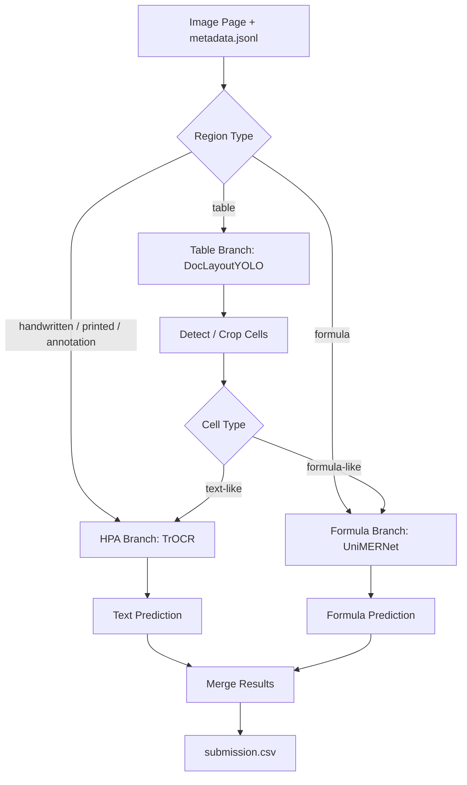

# Báo Cáo Kỹ Thuật: Pipeline OCR 3 Nhánh (RUKOPYS Kaggle)

Báo cáo này tổng hợp kiến trúc tổng quan, luồng xử lý dữ liệu, cách quản lý mô hình và môi trường chạy cho hệ thống OCR phục vụ cuộc thi **RUKOPYS - Ukrainian Handwritten Text Recognition**.

Hệ thống được thiết kế theo hướng modular: mỗi loại vùng dữ liệu được đưa tới một nhánh chuyên biệt, sau đó kết quả được chuẩn hóa và ghép lại thành `submission.csv`.

---

## 1. Tổng Quan Kiến Trúc

Pipeline sử dụng cơ chế routing theo loại region trong metadata:

- `handwritten`, `printed`, `annotation` -> nhánh HPA/TrOCR.
- `formula` -> nhánh Formula/UniMERNet.
- `table` -> nhánh Table/DocLayoutYOLO + OCR từng cell.



---

## 2. Các Nhánh Xử Lý

### 2.1 HPA Branch

Nhánh HPA xử lý các vùng chữ viết tay, chữ in và annotation.

Thông tin chính:

- Kiến trúc: TrOCR / VisionEncoderDecoder.
- Mục tiêu: nhận dạng text line hoặc vùng chữ ngắn/dài thông thường.
- Model artifact không commit trực tiếp lên Git; repo chỉ giữ file link tải model và requirements.

File môi trường liên quan:

```text
branch-hpa/trocr-finetuned-v1/trocr-requirements.txt
```

Dependency chính:

| Package | Phiên bản / ràng buộc |
|---|---|
| `torch` | `>=2.0.0` |
| `torchvision` | `>=0.15.0` |
| `transformers` | `>=4.30.0` |
| `tokenizers` | `>=0.19.1,<0.20` |
| `safetensors` | `>=0.4.3` |
| `huggingface-hub` | `>=0.23.0` |
| `accelerate` | `>=0.31.0` |

### 2.2 Formula Branch

Nhánh Formula xử lý các vùng công thức toán/hóa và biểu thức ký hiệu.

Thông tin chính:

- Kiến trúc: UniMERNet.
- Mục tiêu: nhận dạng công thức từ ảnh crop thành chuỗi công thức tương ứng.
- Model base và checkpoint fine-tuned được lưu ngoài Git, hiện dùng link Kaggle/HuggingFace để tải lại khi cần.
- Repo chỉ giữ script setup, script train/eval, requirements và file link model.

File môi trường liên quan:

```text
branch-formula/unimernet_finetuned_v2(first-entry)/setup_venv_py310.sh
branch-formula/unimernet_finetuned_v2(first-entry)/unimernet-requirements.txt
```

Dependency chính:

| Package | Phiên bản / ràng buộc |
|---|---|
| `python` | `3.10` cho môi trường train UniMERNet |
| `torch` | `>=2.0.0` |
| `torchvision` | `>=0.15.0` |
| `unimernet` | `0.2.3` |
| `transformers` | `4.42.4` |
| `timm` | `0.9.16` |
| `numpy` | `1.26.4` |
| `omegaconf` | `2.3.0` |
| `albumentations` | `1.4.24` |
| `opencv-python-headless` | `4.11.0.86` |
| `fairscale` | `>=0.4.13` |
| `einops` | `>=0.7.0` |

Ghi chú môi trường:

- Cài `torch` / `torchvision` trước từ CUDA wheel index phù hợp.
- Với server headless, ép dùng `opencv-python-headless` để tránh lỗi thiếu thư viện GUI như `libGL.so.1`.
- Script setup mặc định tạo virtualenv `.venv_unimernet` bằng Python 3.10.

### 2.3 Table Branch

Nhánh Table xử lý vùng bảng, vì OCR trực tiếp toàn bộ bảng như một dòng text thường làm mất cấu trúc.

Thông tin chính:

- Model detect layout/cell: DocLayoutYOLO.
- Sau khi detect cell, từng cell được crop và có thể route tiếp sang HPA hoặc Formula.
- Kết quả cell được ghép lại theo hàng/cột, ưu tiên format dạng PSV.
- Model artifact của table cũng không commit trực tiếp lên Git; repo chỉ giữ link tải model và requirements.

File môi trường liên quan:

```text
branch-table/table-requirements.txt
```

Dependency chính:

| Package | Phiên bản / ràng buộc |
|---|---|
| `torch` | `>=2.0.0` |
| `torchvision` | `>=0.15.0` |
| `opencv-python-headless` | latest compatible |
| `doclayout-yolo` | latest compatible |
| `ultralytics` | `>=8.2.0` |

---

## 3. Luồng Xử Lý Dữ Liệu

Quy trình inference tổng quát:

1. Đọc metadata và ảnh đầu vào.
2. Với mỗi region, xác định `type`.
3. Crop vùng ảnh tương ứng với bounding box.
4. Route crop sang nhánh phù hợp:
   - text-like -> HPA,
   - formula -> UniMERNet,
   - table -> DocLayoutYOLO + OCR từng cell.
5. Chuẩn hóa output từng nhánh.
6. Ghép kết quả theo thứ tự cần thiết.
7. Ghi `submission.csv` theo format yêu cầu.

Một số điểm kỹ thuật cần giữ ổn định:

- Bounding box cần được clamp trong biên ảnh để tránh crop lỗi.
- Batch inference nên dùng riêng theo từng nhánh để kiểm soát VRAM.
- Với bảng, cần giữ thứ tự cell theo hàng/cột thay vì chỉ OCR text tuần tự.
- Cần tránh prediction quá dài/hallucination vì Page CER bị ảnh hưởng mạnh.

---

## 4. Quản Lý Model Artifact

Repo Git không lưu trực tiếp model artifact nặng hoặc model-package files.

Các file không commit:

- weight: `.pth`, `.pt`, `.bin`, `.safetensors`, `.ckpt`, `.onnx`, ...
- model config/tokenizer đi kèm nếu nằm trong thư mục model local: `config.json`, `tokenizer.json`, `vocab.json`, `merges.txt`, `preprocessor_config.json`, ...
- cache HuggingFace/PyTorch,
- checkpoint train,
- output experiment.

Các file được giữ lại trong Git:

- `link-kaggle-model.txt`,
- `link-huggingface-model.txt`,
- `README.md`,
- requirements,
- setup script,
- script train/eval/inference,
- tài liệu mô tả chiến lược hoặc báo cáo.

Cách này giúp repo nhẹ, dễ review PR, và tránh lỗi GitHub/Git LFS khi push model lớn.

---

## 5. Quản Lý Môi Trường

Dự án tách môi trường theo từng nhánh để giảm xung đột dependency.

### 5.1 Nguyên Tắc Chung

- Không cài tất cả dependency vào một môi trường duy nhất nếu không cần thiết.
- Mỗi nhánh có requirements riêng.
- Với CUDA, cài `torch` và `torchvision` trước bằng wheel index phù hợp.
- Với server Linux/headless, ưu tiên `opencv-python-headless`.
- Với Kaggle submit/offline, model nên được mount từ Kaggle Dataset hoặc tải sẵn, không phụ thuộc internet.

### 5.2 Formula / UniMERNet Environment

Formula branch yêu cầu môi trường chặt hơn do UniMERNet phụ thuộc vào một số version cụ thể.

Script setup:

```bash
bash branch-formula/unimernet_finetuned_v2(first-entry)/setup_venv_py310.sh
```

Override thường dùng:

```bash
PYTHON_BIN=python3.10 \
VENV_DIR=.venv_unimernet \
TORCH_INDEX_URL=https://download.pytorch.org/whl/cu121 \
bash setup_venv_py310.sh
```

Lý do tách môi trường:

- UniMERNet chạy ổn hơn với Python 3.10.
- `transformers==4.42.4` được pin để tránh lệch API.
- `numpy==1.26.4` tránh rủi ro binary incompatibility với một số thư viện cũ.
- `opencv-python-headless==4.11.0.86` tránh dependency GUI trên cloud/headless server.

### 5.3 HPA / TrOCR Environment

HPA branch nhẹ hơn Formula branch, chủ yếu cần PyTorch + Transformers + tokenizer/safetensors.

File requirements:

```text
branch-hpa/trocr-finetuned-v1/trocr-requirements.txt
```

Có thể dùng chung môi trường với một số pipeline inference nếu không xung đột version, nhưng nên kiểm tra kỹ nếu chạy chung với UniMERNet.

### 5.4 Table Environment

Table branch cần thêm dependency detection/layout.

File requirements:

```text
branch-table/table-requirements.txt
```

Các package chính là `doclayout-yolo`, `ultralytics`, OpenCV và PyTorch.

---

## 6. Các Hướng Thử Nghiệm Theo Từng Nhánh

Các hướng dưới đây là ghi chú thử nghiệm và cải tiến tiềm năng. Đây không phải là yêu cầu bắt buộc của pipeline chung, mà là các hướng có thể thử riêng cho từng nhánh để đánh giá tác động lên CER/WER.

### 6.1 HPA Branch

Nhánh HPA xử lý phần lớn vùng chữ viết tay, chữ in và annotation, nên các thử nghiệm nên tập trung vào độ ổn định của OCR text thông thường.

Các hướng có thể thử:

- Fine-tune thêm TrOCR trên tập gold text nếu có đủ nhãn sạch.
- Tách riêng handwritten / printed / annotation khi evaluate để biết nhóm nào kéo lỗi lên.
- Kiểm tra tokenizer conflict, đặc biệt trường hợp `pad_token_id == bos_token_id` làm generation dừng sớm hoặc sinh chuỗi bất thường.
- Thử các cấu hình generation khác nhau như `max_length`, `num_beams`, `length_penalty`, nhưng cần theo dõi nguy cơ prediction quá dài.
- Log lỗi theo độ dài reference để xem model yếu ở dòng ngắn, dòng dài hay annotation lẫn ký hiệu.

Mục tiêu của nhánh này là giữ output text ổn định và tránh làm hỏng các vùng chữ phổ biến nhất trong dataset.

### 6.2 Formula Branch

Nhánh Formula hiện có nhiều rủi ro hơn vì dữ liệu formula trộn nhiều kiểu: công thức inline, công thức dài, hóa học, ma trận, bảng nhỏ và biểu thức có chữ tự nhiên.

Các hướng có thể thử:

- Fine-tune UniMERNet theo curriculum độ khó, bắt đầu từ formula ngắn rồi mở rộng dần sang formula dài hơn.
- Tách `inline_simple`, `medium_long`, `structured` khi evaluate để không chỉ nhìn một số `val_cer` chung.
- Route bớt matrix/table-like formula sang nhánh table nếu crop có dấu hiệu nhiều dòng, dấu `|`, determinant hoặc bảng logic.
- Train hoặc evaluate structured formula riêng để giảm hallucination ở ma trận, phép chia dọc và công thức nhiều dòng.
- So sánh checkpoint base, checkpoint fine-tuned v1 và checkpoint fine-tuned v2 trên cùng một fixed validation set.
- Kiểm tra nhóm chemistry riêng vì sai một ký tự như `Cl/CN/Br/Al` có thể làm sai nghĩa hoàn toàn.

Mục tiêu của nhánh này là giảm hallucination và tránh để công thức phức tạp làm Page CER xấu đi quá mạnh.

### 6.3 Table Branch

Nhánh Table chịu trách nhiệm giữ cấu trúc bảng, nên trọng tâm thử nghiệm không chỉ là OCR từng cell mà còn là detect cell và ghép lại đúng hàng/cột.

Các hướng có thể thử:

- Tune `conf` và `iou` của DocLayoutYOLO để cân bằng giữa thiếu cell và detect thừa cell.
- Thử các heuristic gom row khác nhau dựa trên `cy`, chiều cao trung bình của cell hoặc overlap theo trục y.
- Log riêng lỗi detect cell và lỗi OCR cell để biết bottleneck nằm ở layout hay nhận dạng chữ/công thức.
- Kiểm tra format PSV với các bảng nhỏ, bảng có cell trống hoặc bảng có cell chứa công thức.
- Route cell theo nội dung hoặc metadata phụ: cell text sang HPA, cell formula sang Formula.
- Xuất debug crop cho các bảng lỗi nặng để kiểm tra bbox, thứ tự cell và row grouping.

Mục tiêu của nhánh này là bảo toàn cấu trúc bảng, vì OCR đúng từng cell nhưng ghép sai hàng/cột vẫn làm submission sai nặng.

### 6.4 Pipeline Chung

Ngoài từng nhánh riêng, vẫn cần một số thử nghiệm ở cấp pipeline để đánh giá tác động tổng thể.

Các hướng có thể thử:

- Tạo fixed validation set chung để so sánh các phiên bản model một cách công bằng.
- Log output theo nhóm region type: `handwritten`, `printed`, `annotation`, `formula`, `table`.
- Theo dõi `ref_len`, `pred_len`, CER per sample và tỷ lệ `pred_len/ref_len` để phát hiện hallucination dài.
- Thử batch size khác nhau theo GPU thực tế để cân bằng tốc độ và VRAM.
- Kiểm thử end-to-end trên subset nhỏ trước khi submit Kaggle full run.
- Quản lý model qua Kaggle/HuggingFace link thay vì commit trực tiếp artifact vào Git.

Mục tiêu ở cấp pipeline là biết nhánh nào đang kéo điểm tổng xuống và tránh tối ưu một nhánh nhưng làm hỏng luồng submit chung.